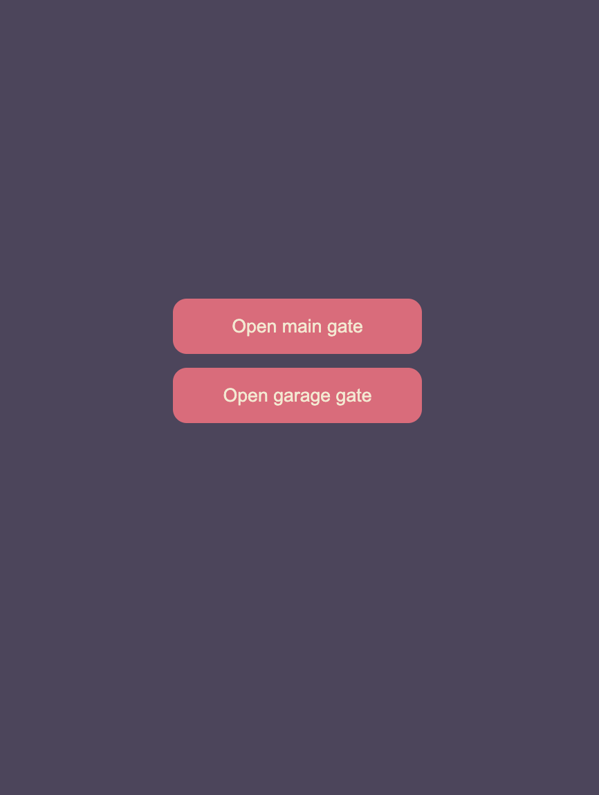
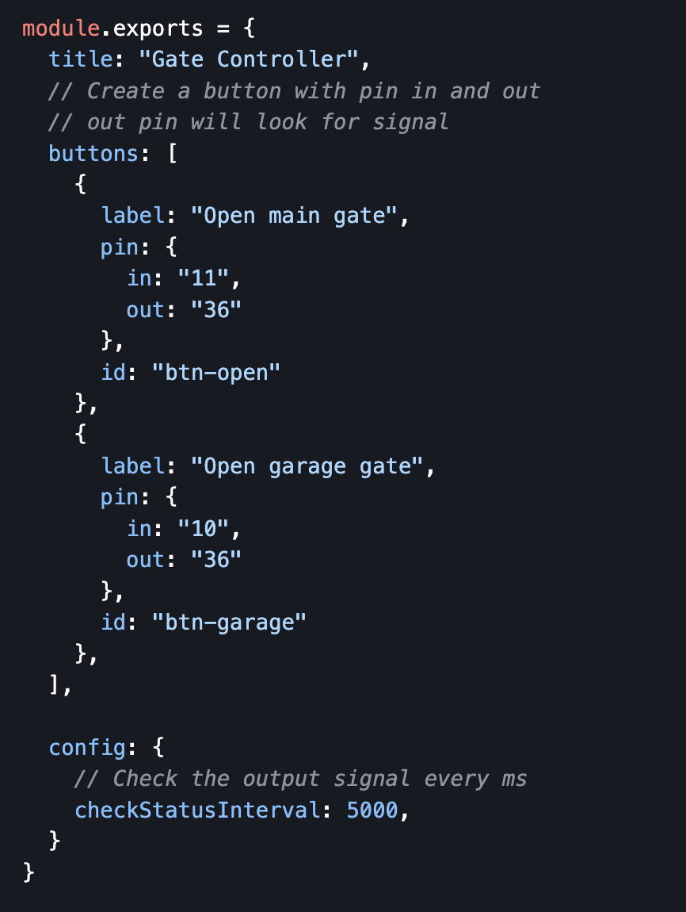

# Introduction
Run a simple web server talk to Raspberry pi using GPIO. Open and close the gate on button click. You can create the button using the [config] file. Update the pin `in` that will signal the Raspberry pi.

If the button has a pinOut. It will check for the `out` signal, if the state is true, it will disabled the button. You can set the interval of checking the `out` signal in the [config] file under `config.checkStatusInterval` setting. By default it is set to 1500ms. It will disabled and enable the button.

## Tech Stack
1. Express - Create a simple server
1. ARRAY-GPIO - npm library to emit and list for switch

## How to start
1. Clone this repo using `git clone https://github.com/Salman2301/gate-ctrl.git`
1. Open terminal to the downloaded folder
1. Copy the env from example `cp .env.example .env`
1. Update env if needed
1. Install package using `npm i`
1. Start the server `npm run start`
    1. Or for development mode use `npm run dev`
1. Open the website http://localhost:3543

## Setup
Create a button ui by updating the [configuration][config] file.

## Example

<!-- link -->
[config]: ./src/config/setting.js

