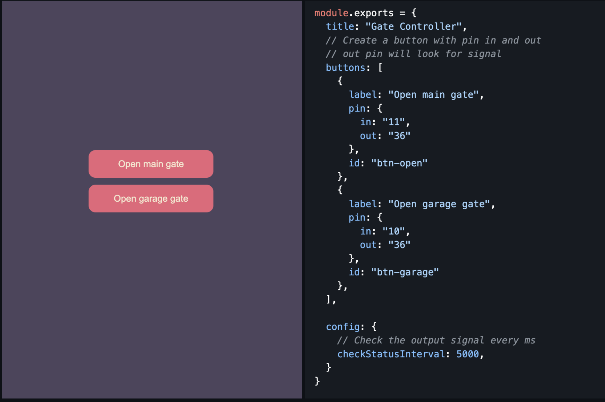

### `!!Work in progress!!`

# Introduction
Run a simple web server talk to Raspberry pi using GPIO. You can create the action using the [config] file. Update the steps fields that will run when the action triggered. The config file has typescript, allow user to write their config at ease. Use editor like **Vscode** for better intellisense.

### Steps
1. `Step Pin`
Trigger the pin, Set the mode to `on` `off` or `toggle`. That will update the pin on the raspberry pi.
 1. `Step Sleep`
This step will wait until it can run the next step. The `wait` field take the value in `ms`.

### Config
##### `checkStatusInterval`
This field is useful for th action button disabled and enabled. This will run through all the action button and check for the `disabled` field. It will take the selector pin and selector state of that action button. If the state of the pin is matched, It will disabled the action button.

## Tech Stack
1. Express - Create a simple server
1. ARRAY-GPIO - npm library to talk to Raspberry pi

## How to start
1. Clone this repo using `git clone https://github.com/Salman2301/gpio-ui.git`
1. Open terminal to the downloaded folder
1. Copy the env from example `cp .env.example .env`
1. Update env if needed
1. Install package using `npm i`
1. Start the server `npm run start`
    1. Or for development mode use `npm run dev`
1. Open the website http://localhost:3543

## Setup
Create a button ui by updating the [configuration][config] file.

## Example
> !Note the config file has been changed check the [config].

### TODO:
 - [x] Move the pin in and pin out logic to backend
 - [ ] Create a password protected page
 - [ ] Create a admin page to add button using UI
 - [ ] Create component
    - [ ] Create Header
    - [ ] Create Layout component

<!-- link -->
[config]: ./src/config/setting.js
